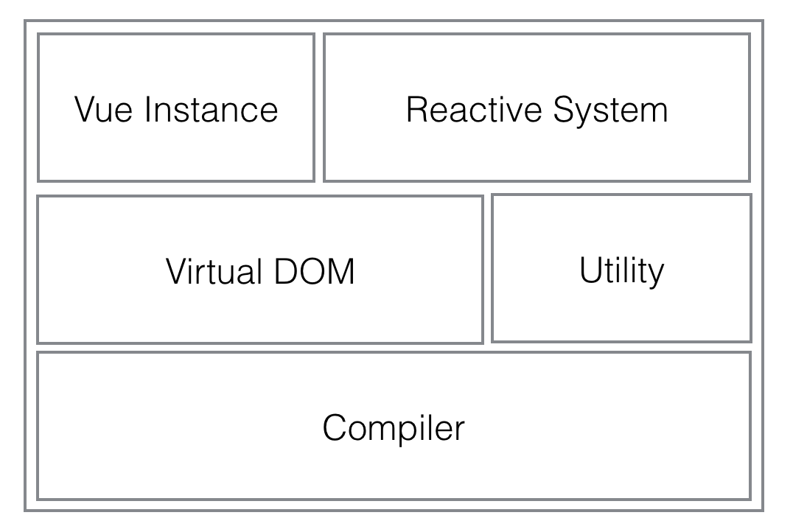

<!-- @import "[TOC]" {cmd="toc" depthFrom=1 depthTo=6 orderedList=false} -->

<!-- code_chunk_output -->

* [1. 创建你自己的vuejs](#1-创建你自己的vuejs)
	* [1.1 Vuejs概览](#11-vuejs概览)
	* [1.2 Vuejs内部的组件](#12-vuejs内部的组件)
		* [1.2.1 实例生命周期](#121-实例生命周期)
		* [1.2.2 响应式系统](#122-响应式系统)
		* [1.2.3 虚拟DOM](#123-虚拟dom)
		* [1.2.4 编译器](#124-编译器)
		* [1.2.5 搭建开发环境](#125-搭建开发环境)
			* [1.2.5.1 配置Rollup打包模块](#1251-配置rollup打包模块)
			* [1.2.5.2 为测试配置Karma和Jasmine](#1252-为测试配置karma和jasmine)
			* [1.2.5.3 目录结构](#1253-目录结构)
		* [1.2.6 启动](#126-启动)
* [2 响应式系统](#2-响应式系统)
	* [2.1 Dep](#21-dep)

<!-- /code_chunk_output -->

# 1.创建你自己的vuejs

## 1.1Vuejs概览

vuejs是个简单而强大的MVVM库，它可以帮助我们搭建现代web用户界面。

写这篇文章时，Vue在github上有36,312个stars。并且每月有230,250的npm下载量。Vue2.0更是为渲染层引入了轻量的虚拟dom实现，这为服务端渲染和原生端组件渲染带来了可能

>作者写这篇文章的时候，Vue在github上有36,312个stars，而译者翻译这篇文章时，Vue已经有107,032个Stars,已经超过了React的106,047个

vuejs宣称是一种渐进式javascript框架，尽管vuejs的核心很小，但是它配套了很多相应的工具和库，可以用来创建大型应用。


## 1.2Vuejs内部的组件

我们首先来熟悉一下Vue内部的核心组件，vue的内部可以拆分成几部分



### 1.2.1实例生命周期

一个新创建的Vue实例会经历多个阶段，比如观察数据，初始化事件，编译模板，渲染。你可以在特定的阶段注册生命周期钩子，这些生命周期钩子将会被调用。

### 1.2.2响应式系统

所谓的响应式系统就是vue‘数据-视图’绑定的黑魔法来源。当你设置vue实例的数据，视图相应的更新，反之亦然。

Vue使用<font color="red">Object.defineProperty</font>使数据对象的属性'响应'。另外使用著名的**观察者模式**来连接数据变化和视图渲染

### 1.2.3虚拟DOM

虚拟DOM是在内存里的javascript对象树，用来映射真实的DOM树。

当数据变化了，vue将会渲染一颗全新的虚拟DOM树，并保存老的树。虚拟DOM模块会diff两颗树的不同，并把变化补丁到真实的DOM树上。

Vue使用[snabbdom](https://github.com/snabbdom/snabbdom)作为虚拟DOM的实现基础，为了和Vue的其他组件兼容，在这个基础上，做了些稍微的修改。

### 1.2.4编译器

编译器的工作就是把模板编译成渲染函数（抽象语法树 ASTs）.编译器把混杂着Vue指令(Vue的指令只是些HTML属性)的HTML以及其他实体解析成一颗树，并会最大化检测出所有的静态子树（所有没有动态绑定的子树），把它们移出渲染。vue使用的html解析器是由[John Resig](https://johnresig.com)所写
>我们不会在这里讲解编译器的实现细节。我们可以在构建环节使用构建工具把Vue模板都编译成渲染函数，所以编译器并不包含在Vue的运行时中。另外我们甚至可以直接写渲染函数，所以编译器并不是理解Vue机制的核心部分。

### 1.2.5搭建开发环境

创建我们自己的vuejs之前，我们首先要做一些环境配置，包括模块打包工具以及测试工具。因为我们将采用*测试-驱动*的流程

因为这是一个javascript项目，我们将使用一些新颖的工具。首先就是跑‘npm init’命令并设置一些项目信息

#### 1.2.5.1配置Rollup打包模块

我们将使用Rollup来打包模块。[Rollup](https://rollupjs.org/guide/en)是一个js模块打包工具.它允许你为你的应用或库使用ES6的import/export语法来进行模块化开发。vuejs也是使用Rollup来打包模块的。

我们将为Rollup创建一个配置文件。在根目录下，创建rollup.conf.js文件：

```js
export default {
  input: 'src/instance/index.js',
  output: {
    name: 'Vue',
    file: 'dist/vue.js',
    format: 'iife'
  },
};
```

不要忘了跑‘npm install rollup rollup-watch --save-dev’命令

####1.2.5.2 为测试配置Karma和Jasmine

测试需要安装一些包，跑下面的命令：

```shell
npm install karma jasmine karma-jasmine karma-chrome-launcher
 karma-rollup-plugin karma-rollup-preprocessor buble  rollup-plugin-buble --save-dev
```

在根目录下，创建karma.conf.js文件：

```js
module.exports = function(config) {
  config.set({
    files: [{ pattern: 'test/**/*.spec.js', watched: false }],
    frameworks: ['jasmine'],
    browsers: ['Chrome'],
    preprocessors: {
      './test/**/*.js': ['rollup']
    },
    rollupPreprocessor: {
      plugins: [
        require('rollup-plugin-buble')(),
      ],
      output: {
        format: 'iife',
        name: 'Vue',
        sourcemap: 'inline'
      }
    }
  })
}
```

####1.2.5.3 目录结构

整个目录结构如下：

```text
- package.json
- rollup.conf.js
- node_modules
- dist
- test
- src
  - observer
  - instance
  - util
  - vdom
```

### 1.2.6启动

我们方便起见，将添加一些npm脚本
*package.json*

```json
"scripts": {
   "build": "rollup -c",
   "watch": "rollup -c -w",
   "test": "karma start"
}
```

为了启动我们自己的vuejs,先写我们的第一个测试用例。
*test/options/options.spec.js*

```js
import Vue from "../../src/instance/index";

describe('Proxy test', function () {
    it('should proxy vm._data.a = vm.a', function () {
        var vm = new Vue({
            data: {
                a: 2
            }
        })
        expect(vm.a).toEqual(2);
    });
});
```

该测试用例测试vm上data的属性（如vm._data.a）,是否都代理到vm上了（比如vm.a）。这是vue其中的一个小技巧。

所以我们可以为我们的vue写下第一行真正代码
*src/instance/index.js*

```js
import { initMixin } from './init'

function Vue (options) {
  this._init(options)
}

initMixin(Vue)

export default Vue
```

粗看只是Vue的构造函数调用了this._init,没什么特别的地方。所以我们来看下‘initMixin’干了什么：
*src/instance/init.js*

```js
import { initState } from './state'

export function initMixin (Vue) {
  Vue.prototype._init = function (options) {
  	var vm = this
  	vm.$options = options
  	initState(vm)
  }
}
```

Vue的实例方法用[织入模式](http://oomusou.io/javascript/mixin/)来注入。我们将会在后面发现Vue经常使用织入模式来添加实例方法。Minxin只是一个函数，它接收一个构造函数的参数，添加一些方法到该构造函数的原型上，并返回这个构造函数。

所以'initMixin‘添加了'_init'方法到'Vue.prototype'。而_init方法调用state.js下的initState方法
*src/instance/state.js*

```js
export function initState(vm) {
  initData(vm)
}

function initData(vm) {
  var data = vm.$options.data
  vm._data = data
  // proxy data on instance
  var keys = Object.keys(data)

  var i = keys.length
  while (i--) {
    proxy(vm, keys[i])
  }
}

function proxy(vm, key) {
    Object.defineProperty(vm, key, {
      configurable: true,
      enumerable: true,
      get: function proxyGetter() {
        return vm._data[key]
      },
      set: function proxySetter(val) {
        vm._data[key] = val
      }
    })
}
```

最后，我们终于看到了proxy-代理。initState调用initData方法,initData遍历vm._data上的所有key,在每个value上调用proxy方法。

proxy用同样的key在vm上定义属性，并且这个属性有setter和getter方法，而getter和setter方法就是从vm._data上获取和设置数据。

这就是vm.a怎么代理到vm._data.a的。

跑‘npm run build’ 和 ‘npm run test’,你应该会看到下面的结果：


很棒！你现在已经启动了自己的vuejs，继续努力！

# 2响应式系统

Vue的响应式系统使model和view之间的数据绑定显得简单自然。数据就是一个javascript对象，当data变更，视图就根据最后的状态相应地更新。堪称完美。
在内部，vuejs将遍历data的所有属性并把它们用Object.defineProperty转成 getter/setter方法
data中的每一个原始键值对，都分配一个Observer对象

## 2.1Dep